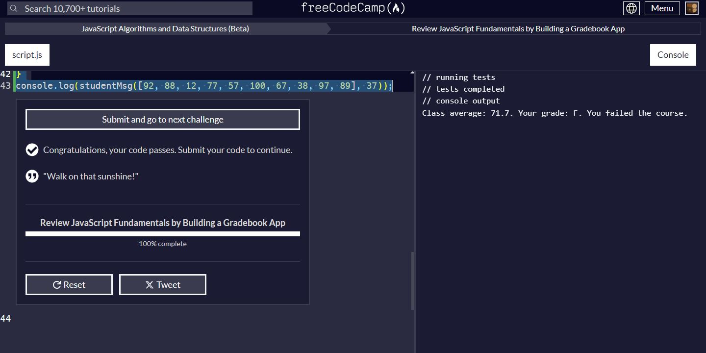

# Gradebook App

## Description

This repository contains a JavaScript project that simulates a simple gradebook application. The project is part of the freeCodeCamp curriculum, specifically the challenge "Review JavaScript Fundamentals by Building a Gradebook App." The purpose of this project is to reinforce basic JavaScript concepts such as loops, conditionals, functions, and array manipulation.

## Code Explanation

The code provided includes functions to calculate the average score of a class, determine letter grades, check if a student has passed, and generate a summary message for a student.

### Functions

#### getAverage

```javascript
function getAverage(scores) {
  let sum = 0;

  for (const score of scores) {
    sum += score;
  }

  return sum / scores.length;
}
```

- **Parameters**:
  - `scores`: An array of numerical scores.
  
- **Returns**: The average score of the input array.
  
This function calculates the sum of all scores in the array and divides by the number of scores to find the average.

#### getGrade

```javascript
function getGrade(score) {
  if (score === 100) {
    return "A++";
  } else if (score >= 90) {
    return "A";
  } else if (score >= 80) {
    return "B";
  } else if (score >= 70) {
    return "C";
  } else if (score >= 60) {
    return "D";
  } else {
    return "F";
  }
}
```

- **Parameters**:
  - `score`: A numerical score.
  
- **Returns**: A letter grade corresponding to the score.
  
This function maps a numerical score to a letter grade based on predefined ranges.

#### hasPassingGrade

```javascript
function hasPassingGrade(score) {
  return getGrade(score) !== "F";
}
```

- **Parameters**:
  - `score`: A numerical score.
  
- **Returns**: `true` if the grade is passing (not an "F"), otherwise `false`.
  
This function checks if a given score corresponds to a passing grade.

#### studentMsg

```javascript
function studentMsg(totalScores, studentScore) {
  const classAverage = getAverage(totalScores);
  const studentGrade = getGrade(studentScore);
  const passed = hasPassingGrade(studentScore);
  let message = `Class average: ${classAverage}. Your grade: ${studentGrade}.`;
  if (passed) {
    message += ' You passed the course.';
  } else {
    message += ' You failed the course.';
  }
  return message;
}
```

- **Parameters**:
  - `totalScores`: An array of numerical scores representing the class.
  - `studentScore`: A numerical score of a specific student.
  
- **Returns**: A summary message for the student.
  
This function calculates the class average, determines the student's grade, checks if the student has passed, and generates a summary message accordingly.

### Example Usage

```javascript
console.log(studentMsg([92, 88, 12, 77, 57, 100, 67, 38, 97, 89], 37));
```

This example calculates the class average, determines the grade and passing status of a student with a score of 37, and prints the corresponding message.

## Screenshot

Here's a screenshot of the Gradebook app in action:



## Contribution

Feel free to fork this repository and make improvements. Pull requests are welcome!

